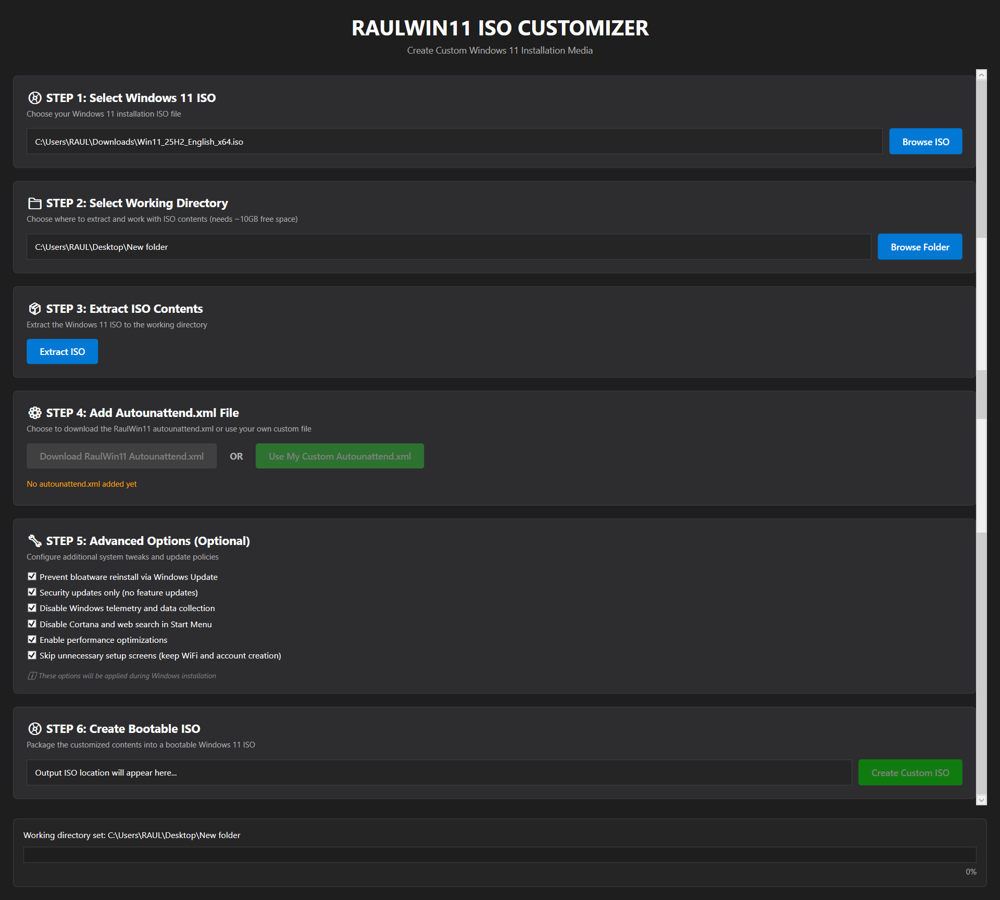
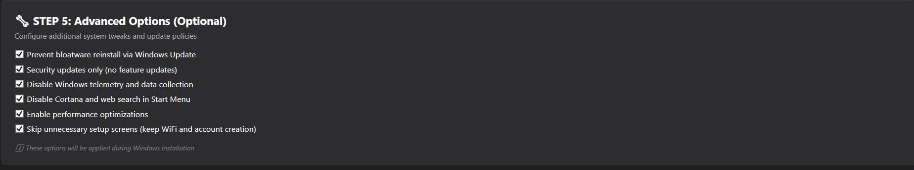

# 🪟 RAULWIN11 ISO CUSTOMIZER

<div align="center">


**Create custom Windows 11 installation media with bloatware removal, privacy tweaks, and automated setup**

[📥 Download Latest Release](../../releases/latest) • [📖 Documentation](QUICK_START.md) • [🎥 Video Tutorial](#) • [🐛 Report Bug](../../issues)



</div>

---

## ✨ Features

### 🎯 **Core Functionality**
- 🔨 **Extract & Customize Windows 11 ISO** - Unpack official ISO, modify, and repack
- 📝 **Autounattend.xml Integration** - Download from GitHub or use your custom file
- 💿 **Bootable ISO Creation** - Creates UEFI + BIOS compatible installation media
- 🎨 **Modern WPF Interface** - Dark theme, resizable window, real-time progress tracking

### 🛡️ **Advanced Options** (All Optional)

#### ✅ Bloatware Prevention
- Blocks 15+ unwanted apps (Teams, OneDrive, Clipchamp, etc.)
- Prevents reinstallation via Windows Update
- Stops Microsoft Store auto-downloads
- No more promotional apps after feature updates

#### 🔒 Security Updates Only
- Configure Windows Update for security patches only
- Defer feature updates by 365 days
- No automatic driver updates
- No forced restarts while logged in
- **You stay in control** of when to upgrade Windows versions

#### 🔐 Privacy & Telemetry
Disables all Windows data collection:
- ❌ Advertising ID tracking
- ❌ Diagnostic data & telemetry
- ❌ Activity history sync
- ❌ Inking & typing personalization
- ❌ Online speech recognition
- ❌ Cloud search indexing
- ❌ Feedback requests
- ✅ **Camera & Microphone remain user-controlled**

#### 🎤 Cortana Disabled
- Completely disables Cortana assistant
- Removes Bing search from Start Menu
- Local search only (faster & more private)

#### ⚡ Performance Optimizations
- Disables unnecessary services (SysMain, Search Indexing)
- Reduces visual effects for better responsiveness
- Eliminates startup delays
- Limits background apps

#### 🚀 OOBE Skip (Smart)
**Skips promotional screens while keeping essentials:**
- ✅ WiFi configuration - **AVAILABLE**
- ✅ Local account creation - **AVAILABLE**
- ❌ Privacy settings slideshow - **SKIPPED** (auto-configured to minimal)
- ❌ Cortana setup - **SKIPPED**
- ❌ OneDrive sync - **SKIPPED**
- ❌ Microsoft 365 trial - **SKIPPED**
- ❌ "Getting the latest features" slideshow - **SKIPPED**

**Result:** Installation completes in ~15-20 minutes instead of 25-30!

---

## 📸 Screenshots

<div align="center">

### Main Interface


### What's included in RaulWin11 autounattend


</div>

---

## 🚀 Quick Start

### For Users (Install & Use)

1. **Download Installer**
   ```
   📥 Get the latest installer from Releases
   ```

2. **Install Application**
   ```
   Run: RaulWin11IsoCustomizer-Setup-v1.0.0.exe
   Follow the wizard (1-2 minutes)
   ```

3. **Prerequisites**
   - Windows 10/11 (64-bit)
   - [Windows ADK](https://go.microsoft.com/fwlink/?linkid=2243390) - Install **Deployment Tools** only
   - 15GB free disk space

4. **Use Application**
   - Select Windows 11 ISO
   - Choose working directory
   - Extract ISO
   - Add autounattend.xml (download or custom)
   - Create custom ISO
   - **Done!** 🎉


---

### For Developers (Build from Source)

#### Prerequisites
- [.NET 8 SDK](https://dotnet.microsoft.com/download/dotnet/8.0)
- [Inno Setup](https://jrsoftware.org/isdl.php) (for creating installer)
- Windows 10/11 (64-bit)

#### Build Steps

**Option 1 - Automated (Recommended):**
```bash
# Run build script
build-for-inno.bat

# Compile installer in Inno Setup
# Open installer.iss in Inno Setup Compiler
# Build → Compile
```

**Option 2 - Manual:**
```bash
# Restore packages
dotnet restore

# Build release
dotnet build -c Release

# Publish self-contained
dotnet publish -c Release -r win-x64 --self-contained true \
  -p:PublishSingleFile=true \
  -p:IncludeNativeLibrariesForSelfExtract=true \
  -p:PublishReadyToRun=true \
  -o publish
```
---

## 🎯 Use Cases

### 🏠 Home Users
- Clean Windows installation without bloatware
- Privacy-focused setup
- Faster installation process

### 💼 IT Professionals
- Deploy customized Windows to multiple PCs
- Pre-configured privacy and security settings
- Consistent user experience across organization

### 🎓 Students & Educators
- Learning about Windows customization
- Understanding registry tweaks
- Creating teaching materials

### 🎮 Gamers
- Performance-optimized Windows
- Minimal background processes
- Maximum resources for games

---

## 🔧 How It Works


### Technical Implementation

1. **ISO Extraction**
   - Mounts ISO using PowerShell
   - Copies all files to working directory
   - Removes read-only attributes

2. **Autounattend.xml**
   - Downloads from GitHub or uses custom file
   - Places in ISO root for automatic processing


3. **ISO Creation**
   - Uses `oscdimg.exe` from Windows ADK
   - Creates dual-boot ISO (UEFI + BIOS)
   - Maintains bootability with proper boot sectors

---

## 📊 Comparison

| Feature | Standard Windows 11 | RAULWIN11 Custom ISO |
|---------|---------------------|----------------------|
| Bloatware | ✅ Included | ❌ Removed & Blocked |
| Telemetry | ✅ Enabled | ❌ Disabled |
| Feature Updates | 🔄 Automatic | ⏸️ Manual Control |
| OOBE Duration | ~10 minutes | ~2 minutes |
| Privacy Settings | 😐 Basic | 🔒 Maximum |
| Performance | ⚡ Standard | ⚡⚡ Optimized |
| User Control | 🎛️ Limited | 🎛️ Complete |

---

## ❓ FAQ

<details>
<summary><b>Is this safe? Will it break Windows?</b></summary>

Yes, it's completely safe! All tweaks are:
- Standard registry modifications used by IT professionals
- Reversible through Settings or Registry Editor
- Tested on Windows 11 23H2 and 24H2
- No core system files are modified
</details>

<details>
<summary><b>Do I need .NET installed to use the application?</b></summary>

**For users:** NO! The installer includes everything needed (self-contained).

**For developers:** YES! You need .NET 8 SDK to build from source.
</details>

<details>
<summary><b>Can I use this with Windows 10?</b></summary>

The application is designed for Windows 11 ISO files. Most features will work with Windows 10, but some registry paths may differ. Windows 11 is recommended.
</details>

<details>
<summary><b>Will bloatware come back after Windows Update?</b></summary>

**With "Prevent bloatware reinstall" enabled:** NO! Apps are blocked via Group Policy and registry.

**Without the option:** Yes, some apps may reinstall during feature updates.
</details>

<details>
<summary><b>Can I still get Windows updates?</b></summary>

**With "Security updates only":** You'll receive security patches and critical updates monthly.

**Feature updates:** Deferred for 365 days, but you can manually install anytime via Settings.
</details>

<details>
<summary><b>Are Camera and Microphone blocked?</b></summary>

**NO!** Camera and Microphone permissions are left for user choice. Windows will ask you the first time you use them. Only Location is set to Deny by default (can be changed in Settings).
</details>

<details>
<summary><b>Can I change settings after installation?</b></summary>

Yes! All tweaks can be modified through:
- Settings app
- Group Policy Editor (gpedit.msc)
- Registry Editor (regedit.exe)
</details>

<details>
<summary><b>Why do I need Windows ADK?</b></summary>

Windows ADK provides `oscdimg.exe`, the official Microsoft tool for creating bootable ISO files. It's required to package the custom ISO correctly.
</details>

---

## 🤝 Contributing

Contributions are welcome! Here's how you can help:

### 🐛 Report Bugs
- Open an [Issue](../../issues) with detailed description
- Include steps to reproduce
- Attach screenshots if applicable

### 💡 Suggest Features
- Check existing [Issues](../../issues) first
- Open a new issue with `[Feature Request]` tag
- Describe the feature and its benefits

### 🔧 Submit Pull Requests
1. Fork the repository
2. Create a feature branch (`git checkout -b feature/AmazingFeature`)
3. Commit your changes (`git commit -m 'Add some AmazingFeature'`)
4. Push to the branch (`git push origin feature/AmazingFeature`)
5. Open a Pull Request

### 📝 Improve Documentation
- Fix typos or unclear explanations
- Add examples or screenshots
- Translate to other languages

---

## 📜 License

This project is licensed under the **MIT License** - see the [LICENSE](LICENSE) file for details.

```
Copyright (c) 2025 Raul Capelaru - Tutoriale cu Raul

Permission is hereby granted, free of charge, to any person obtaining a copy
of this software and associated documentation files (the "Software"), to deal
in the Software without restriction, including without limitation the rights
to use, copy, modify, merge, publish, distribute, sublicense, and/or sell
copies of the Software, and to permit persons to whom the Software is
furnished to do so, subject to the following conditions:

The above copyright notice and this permission notice shall be included in all
copies or substantial portions of the Software.
```

---

## 🙏 Acknowledgments

### Technologies Used
- [.NET 8](https://dotnet.microsoft.com/) - Cross-platform framework
- [WPF](https://docs.microsoft.com/en-us/dotnet/desktop/wpf/) - Windows Presentation Foundation
- [Windows ADK](https://docs.microsoft.com/en-us/windows-hardware/get-started/adk-install) - Assessment and Deployment Kit
- [Inno Setup](https://jrsoftware.org/isinfo.php) - Installer creator

### Inspiration
- [schneegans.de/windows/unattend-generator](https://schneegans.de/windows/unattend-generator/) - Autounattend.xml generator
- Windows 11 community feedback and feature requests
- Privacy-focused users worldwide

---

## 📞 Support & Contact

### 🌐 Official Links
- **Website:** [tutorialecuraul.ro](https://tutorialecuraul.ro)
- **YouTube:** [@tutorialecuraul](https://www.youtube.com/@tutorialecuraul)
- **GitHub:** [@RaulCapelaru](https://github.com/RaulCapelaru)

### 💬 Get Help
- **Documentation:** Check guides in `/docs` folder
- **Issues:** [GitHub Issues](../../issues)
- **Discussions:** [GitHub Discussions](../../discussions)

### ☕ Support the Project
If this tool helped you, consider:
- ⭐ **Star this repository**
- 📢 **Share with others**
- 💬 **Leave feedback**
- 🎥 **Subscribe to YouTube channel**

---

## 📊 Stats


---
---

<div align="center">

## 🌟 Star History

[](https://star-history.com/#RaulCapelaru/RaulWin11IsoCustomizer&Date)

---

**© 2026 Raul Capelaru | Tutoriale cu Raul**

[⬆ Back to Top](#-raulwin11-iso-customizer)

</div>
